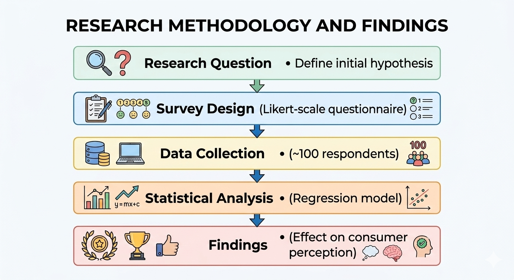
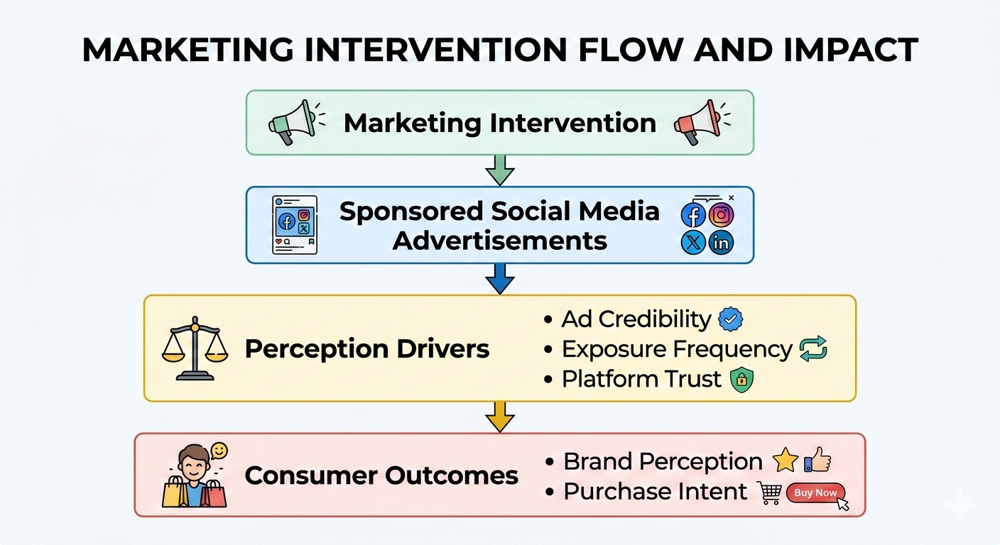
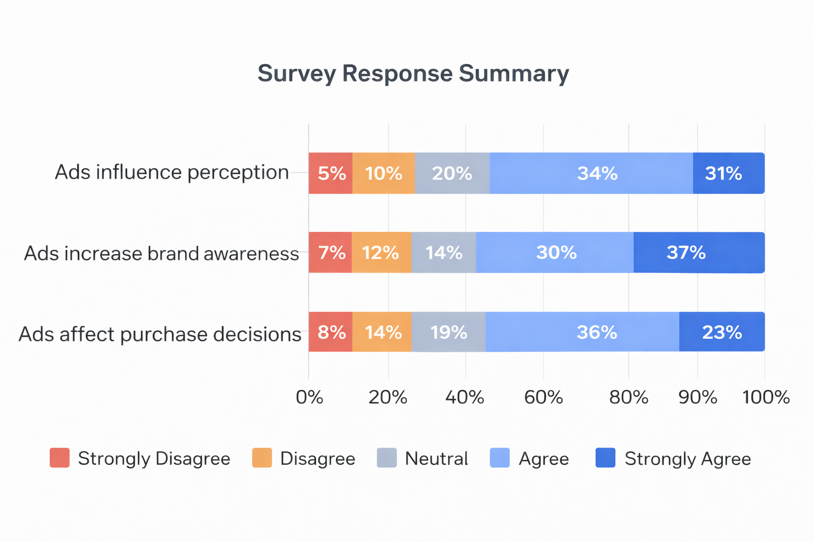
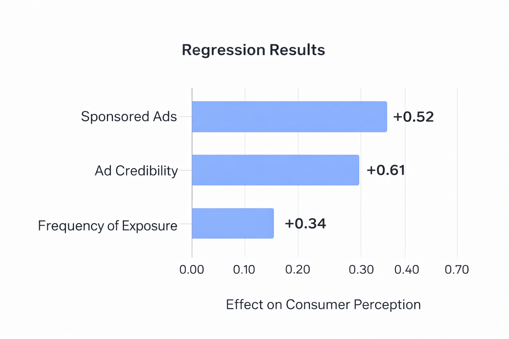

# Impact of Sponsored Advertisements on Consumer Perception

> *A survey-based study analyzing how sponsored social media advertisements influence consumer perception using regression analysis.*

This repository presents a research study examining how **sponsored advertisements on social media platforms influence consumer perception and buying behaviour**.

With the rapid growth of digital marketing, sponsored advertisements have become a primary channel through which brands communicate with consumers. This project explores whether these advertisements meaningfully shape consumer attitudes and purchase decisions.

The study combines **survey-based primary data with statistical analysis** to evaluate the strength of this relationship and identify the advertising attributes that most strongly influence consumer perception.

The goal of the project is to understand **how exposure to sponsored content translates into consumer trust, engagement, and eventual purchase intent**.

---

## Research Objective

The study aims to evaluate whether sponsored advertisements on social media platforms significantly influence consumer perception and buying behaviour.

Key questions explored include:

* Do sponsored advertisements meaningfully influence consumer perception?
* Which attributes of sponsored advertisements drive stronger engagement?
* How does advertisement exposure translate into purchase behaviour?

---

## Research Design

The study follows a structured quantitative research design combining **primary data collection with statistical analysis**.

* **Data Source:** Survey responses collected from social media users
* **Method:** Structured questionnaire measuring advertisement exposure and consumer perception
* **Analysis Techniques:** Correlation analysis and regression modelling

The research design allows the study to examine the relationship between **advertising characteristics and consumer perception in a systematic way**.

The above diagram illustrates the overall analytical process, from survey data collection to statistical analysis.

---

## Conceptual Framework

The conceptual model evaluates how different characteristics of sponsored advertisements influence consumer perception.

Independent variables include factors such as:

* Advertisement relevance
* Advertisement credibility
* Frequency of advertisement exposure
* Platform visibility

These factors are examined to determine their influence on **consumer attitudes and buying behaviour**.

The above conceptual framework shows how sponsored advertisements may influence consumer perception and ultimately buying behaviour.

---

## Key Variables

The study evaluates the relationship between sponsored advertisements and consumer perception using the following variables:

**Independent Variables**
- Advertisement relevance
- Advertisement credibility
- Frequency of advertisement exposure

**Dependent Variable**
- Consumer perception of the brand

---

## Methodology

The analytical process followed several key steps:

**1. Survey Development**

A structured questionnaire was designed to capture consumer exposure to sponsored advertisements and their perception of those advertisements.

**2. Data Collection**

Survey responses were collected from participants who actively use social media platforms and are regularly exposed to sponsored advertisements.

**3. Data Preparation**

Responses were cleaned and organized to ensure consistency before statistical analysis.

**4. Statistical Analysis**

Quantitative methods were applied to evaluate relationships between advertising attributes and consumer perception.

The analysis focused on identifying whether sponsored advertisements have a **statistically meaningful impact on consumer attitudes and purchase behaviour**.

---

## Survey Response Overview

The survey responses provide an overview of how participants perceive and interact with sponsored advertisements on social media platforms.

The survey results provide descriptive insights into how respondents perceive sponsored advertisements on social media. 

The descriptive results highlight patterns in how respondents perceive advertisement exposure, engagement, and overall influence.

---

## Regression Analysis

Regression analysis was conducted to evaluate the relationship between sponsored advertisement attributes and consumer perception.

The regression results evaluate the relationship between sponsored advertisement attributes and consumer perception.

The analysis suggests that certain advertisement characteristics — particularly **relevance and credibility** — have a stronger influence on consumer perception compared to simple exposure frequency.

---

## Key Findings

The analysis highlights several important insights:

* Sponsored advertisements can influence consumer perception when the content is perceived as **relevant and credible**.
* High exposure to advertisements increases **brand awareness**, but does not always translate directly into purchase behaviour.
* Consumers respond more positively to advertisements that appear **targeted and contextually relevant**.
* Trust in the advertisement content plays an important role in shaping overall perception of the brand.

These findings suggest that the effectiveness of digital advertising depends less on sheer volume and more on **quality, credibility, and contextual relevance**. 

Overall, the results indicate that the effectiveness of sponsored advertising depends not only on exposure but also on the perceived relevance and credibility of the content.

---

## Tools & Techniques Used

* Survey-based primary research
* Quantitative data analysis
* Correlation analysis
* Regression modelling
* Hypothesis testing

---

## Project Scope

This project demonstrates how **structured research methods and statistical analysis can be applied to understand consumer behaviour in digital marketing environments**.

The study combines survey design, data collection, and statistical analysis to generate insights on how sponsored advertisements influence consumer perception.

---
